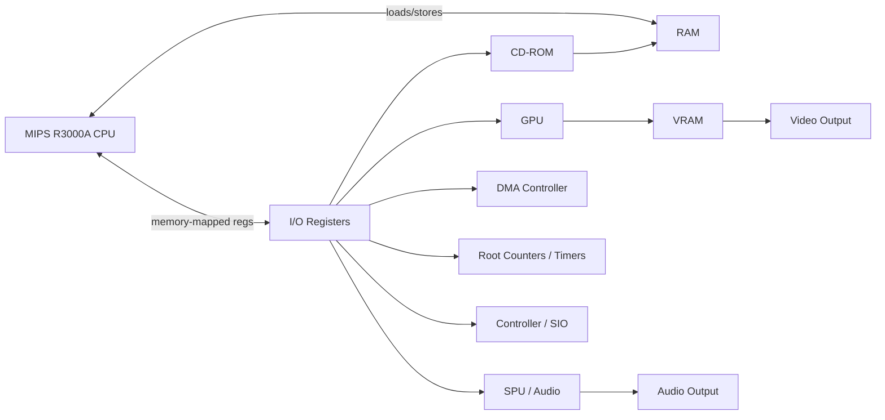

# Emulation 101 (and how this repo works)

This guide is written for a web developer who can read JavaScript but has never built (or studied) an emulator.

If you only read one section, read **“The Big Picture”** and **“A Frame in This Emulator”**.

---

## Table of contents

- [What emulation is (in one paragraph)](#what-emulation-is-in-one-paragraph)
- [The big picture: what you are simulating](#the-big-picture-what-you-are-simulating)
- [How this project is organized](#how-this-project-is-organized)
- [The data model: memory + registers + devices](#the-data-model-memory--registers--devices)
- [A frame in this emulator (the runtime loop)](#a-frame-in-this-emulator-the-runtime-loop)
- [CPU execution (MIPS R3000A)](#cpu-execution-mips-r3000a)
- [Memory mapping + I/O registers](#memory-mapping--io-registers)
- [Interrupts (IRQs) and why timing matters](#interrupts-irqs-and-why-timing-matters)
- [DMA (fast bulk transfers)](#dma-fast-bulk-transfers)
- [GPU pipeline in this codebase](#gpu-pipeline-in-this-codebase)
- [Audio pipeline in this codebase](#audio-pipeline-in-this-codebase)
- [CD-ROM / ISO reads in this codebase](#cd-rom--iso-reads-in-this-codebase)
- [Common “emulator bugs” explained](#common-emulator-bugs-explained)
- [How to explore/debug this emulator](#how-to-exploredebug-this-emulator)
- [Glossary](#glossary)

---

## What emulation is (in one paragraph)

An emulator runs software designed for one computer (the *guest*, here: the PlayStation 1) on a different computer (the *host*, here: your browser + JS engine) by **simulating the guest’s CPU, memory, and hardware devices**. The goal is not just to compute the same results, but to do so in a way that matches how the original hardware behaves (especially around timing, interrupts, and I/O).

---

## The big picture: what you are simulating

At a high level, a PS1 game “sees” a system like this:

Key idea: **Almost everything is “memory-mapped”**. The CPU reads/writes special addresses; those reads/writes are interpreted as commands to devices.

---

## How this project is organized

This repo is a browser-based PS1 emulator. The build output that runs in the browser is loaded by:

- [index.html](../index.html)
- It loads [dist/pseudo.js](../dist/pseudo.js)

The source lives in [src/](../src/). The author uses a C preprocessor step to make JS look a bit like C (macros, inlining, etc).

### The “C-like macros in JS” trick

The file [src/0.h](../src/0.h) defines a bunch of `#define` macros and aliases that make JS code shorter and faster (and also more “C emulator”-looking).

Examples:

- `union(size)` creates an `ArrayBuffer` plus typed views (`Uint32Array`, `Uint16Array`, etc.) so you can treat the same bytes as 8/16/32-bit values.
- `directMemW/H/B(view, addr)` are fast address-to-index helpers.

The build script [build](../build) concatenates the `.h` and `.js` files, runs the C preprocessor (`cpp`), then strips blank lines and writes [dist/pseudo.js](../dist/pseudo.js).

If you’re on Windows, building is easiest through WSL, Git Bash, or by just using the already-built [dist/pseudo.js](../dist/pseudo.js).

---

## The data model: memory + registers + devices

Emulators are usually easiest to understand as **state + transitions**:

- **State**: RAM bytes, ROM bytes, hardware registers, device buffers, CPU registers.
- **Transition**: “Execute one CPU instruction”, “advance timers”, “process GPU commands”, “raise an interrupt”, etc.

In this codebase:

- **CPU registers** live in `cpu.base` (a typed array)
- **RAM/ROM/HWR** (hardware register backing memory) live in [src/mem.js](../src/mem.js)
- **Hardware devices** are modules like:
  - [src/vs.js](../src/vs.js) (GPU command handling + VRAM transfers)
  - [src/render.js](../src/render.js) (WebGL rendering)
  - [src/audio.js](../src/audio.js) (SPU decoding + Web Audio)
  - [src/cdrom.js](../src/cdrom.js) (CD controller + ISO reads)
  - [src/counters.js](../src/counters.js) (root counters/timers + vblank pacing)
  - [src/sio.js](../src/sio.js) (controller/SIO)
  - [src/bus.js](../src/bus.js) (interrupt scheduling + DMA dispatch)

---

## A frame in this emulator (the runtime loop)

The main “scheduler” for the whole machine is the CPU loop in [src/mips.js](../src/mips.js).

The core logic is:

1. Run N CPU instructions (a small batch)
2. Tick devices (timers, CD, interrupt scheduler)
3. If an interrupt is pending and enabled, enter the CPU’s exception handler
4. Yield to the browser, then repeat

The relevant pieces you can search for:

- `cpu.run()` — the time-sliced run loop
- `rootcnt.update(64)` — advances timers and triggers VBlank
- `bus.update()` — turns queued interrupts into actual interrupt status bits
- `setTimeout(cpu.run, 0)` — yields back to the browser so the tab doesn’t freeze

### Why “yielding” matters in a browser

A native emulator might run a tight loop that never yields until you close it.

A browser emulator must periodically give control back to the event loop so:

- the UI can repaint
- input events can be processed
- the page doesn’t “hang”

This project does that by chunking work and using `setTimeout(..., 0)`.

---

## CPU execution (MIPS R3000A)

The PS1 CPU is a MIPS R3000A. Emulating a CPU means repeating:

1. **Fetch** the next instruction (32-bit word) from memory
2. **Decode** its fields (opcode, registers, immediates)
3. **Execute** it (update registers, memory, PC)

In this repo:

- The interpreter lives in [src/mips.js](../src/mips.js)
- Instructions are implemented in a big `switch(opcode)` (and sub-switches)
- The CPU state is stored in typed arrays for speed

### Important CPU concepts you’ll see in code

- **PC** (program counter): address of the current instruction.
- **Registers**: general-purpose (`cpu.base[0..31]`), plus `pc`, `lo`, `hi`.
- **Branches and delay slots**: classic MIPS executes the instruction after a branch before it actually jumps. Emulators have to be careful here.
- **Exceptions**: interrupts and certain errors force the CPU to jump to exception vectors.

This emulator also includes COP2 (GTE) support in [src/cop2.js](../src/cop2.js), which is important for 3D math and many games.

---

## Memory mapping + I/O registers

The PS1 CPU uses a 32-bit address space, but devices “live” in certain address ranges.

In this repo, memory reads/writes are routed based on the top byte of the address (see [src/mem.js](../src/mem.js)):

- RAM: `0x00xxxxxx`, `0x80xxxxxx`, `0xA0xxxxxx`
- BIOS ROM: `0xBFxxxxxx`
- Hardware registers / scratch: `0x1Fxxxxxx` (with a split around `0x1F801400`)

### Why hardware registers look like normal memory

When the game writes something like “GPU command port”, it’s literally doing a store instruction to a magic address.

So your emulator’s “memory write” function must do something like:

- If address is RAM: write RAM
- If address is a device register: call device logic

That routing logic is implemented in [src/io.js](../src/io.js), which maps address ranges to device handlers.

---

## Interrupts (IRQs) and why timing matters

An interrupt is “hardware shouting at the CPU”:

- “VBlank happened!” (time to update frame)
- “DMA finished!”
- “CD sector is ready!”
- “Controller has data!”

In a PS1-like system, interrupts are represented by:

- A **status** register: which interrupts are currently pending
- A **mask** register: which interrupts are enabled

In this repo, those are backed by hardware memory at the classic PS1 IRQ addresses:

- status: `0x1F801070`
- mask: `0x1F801074`

The helper macros in [src/0.h](../src/0.h) expose these as `data16/data32` and `mask16/mask32`.

### How interrupts are “scheduled” here

Instead of firing instantly, interrupts can be queued and delivered after a small delay. That is a timing hack that often helps with realism.

- [src/bus.js](../src/bus.js) has an `interrupts[]` table.
- Calling `bus.interruptSet(code)` sets `queued = 1`.
- `bus.update()` increments `queued` until it reaches `dest`, then sets the interrupt bit.

This is one place where emulator correctness is very timing-sensitive.

---

## DMA (fast bulk transfers)

DMA is basically “copy a lot of data without the CPU doing it word-by-word”.

On PS1, DMA is used heavily for:

- feeding GPU command lists
- transferring textures/VRAM data
- streaming CD sectors into RAM
- moving audio data

In this repo:

- Writes to DMA registers are handled in [src/io.js](../src/io.js)
- When a DMA channel control register changes, [src/bus.js](../src/bus.js) calls `bus.checkDMA(...)`
- That dispatches to the device for the channel:
  - GPU: `vs.executeDMA(...)`
  - CDROM: `cdrom.executeDMA(...)`
  - SPU: `audio.executeDMA(...)`
  - MDEC: `mdec.executeDMA(...)`
  - Clear OT: `mem.executeDMA(...)`

Once DMA completes, the DMA interrupt bit may be raised depending on DICR configuration.

---

## GPU pipeline in this codebase

The PS1 GPU is command-driven: the CPU (or DMA) writes commands, and the GPU updates VRAM and draws.

In this project the pipeline is split into two layers:

1. **GPU command parsing + VRAM ops**: [src/vs.js](../src/vs.js)
2. **Actual drawing on the HTML canvas**: [src/render.js](../src/render.js) using WebGL

### GPU command flow

- CPU writes GPU ports (memory-mapped)
- [src/io.js](../src/io.js) routes those writes to `vs.scopeW(...)`
- When DMA feeds GPU, `vs.executeDMA(...)` pulls command words from RAM
- [src/vs.js](../src/vs.js) collects the right number of parameters per command (the `pSize[]` table)
- Once a full command packet is assembled, it calls `render.draw(prim, pipe.data)`

### VRAM

- VRAM is modeled as a typed buffer: `vs.vram` (see [src/vs.js](../src/vs.js))
- Transfers between RAM and VRAM go through “VRAM operations” code paths
- There’s also a texture-cache style helper in [src/tcache.js](../src/tcache.js) (used in VRAM conversion)

---

## Audio pipeline in this codebase

The PS1 SPU stores sample data in SPU RAM and plays voices.

In this repo:

- [src/audio.js](../src/audio.js) stores SPU RAM in a `union(...)` buffer (`spuMem`)
- It decodes ADPCM blocks for each voice into a temporary sample buffer
- It outputs audio using the Web Audio API (`AudioContext` + a ScriptProcessorNode)

This is conceptually similar to rendering frames:

- emulated device state → decode into host-friendly buffers → push to host API

---

## CD-ROM / ISO reads in this codebase

Commercial PS1 games are often loaded from disc images (ISO/BIN).

This project supports dropping an ISO-like file in the UI:

- [src/pseudo.js](../src/pseudo.js) checks for ISO9660 marker `CD001`
- It stores the dropped file in a variable (`iso`)
- The CD-ROM device requests reads by eventually calling `psx.trackRead(time)`
- `trackRead(...)` computes an offset and uses a `FileReader` slice to pull one sector’s worth of bytes
- That sector data is passed back into the CDROM device (`cdrom.interruptRead2(...)`)

This is a nice example of “bridge guest hardware to the browser”:

- On a real PS1: the CD drive would deliver bytes over time
- In a browser: you emulate “delivery” by reading a slice of a file and raising an interrupt

---

## Common “emulator bugs” explained

These are issues you’ll run into *constantly* when learning emulation:

- **Black screen, but no crash**: often GPU command parsing or VRAM transfer bugs.
- **Boots, but freezes after a second**: often interrupts, timers, or DMA completion flags.
- **Audio crackles**: output buffer sizes, sample rate mismatches, or SPU timing.
- **Game runs too fast/too slow**: your “number of instructions per tick” and how you map that to real time is off.
- **Works in one game, fails in another**: lots of games rely on undefined/quirky behavior, especially around DMA and timing.

This repo’s README also calls out that timing accuracy is a major limiter.

---

## How to explore/debug this emulator

A good workflow for learning this codebase:

1. Start at the top-level orchestrator in [src/pseudo.js](../src/pseudo.js)
2. Follow the reset sequence to see which devices exist
3. Read the memory router in [src/mem.js](../src/mem.js) and I/O router in [src/io.js](../src/io.js)
4. Study one pipeline end-to-end:
   - CPU → GPU (commands) → Render
   - or CPU → CDROM → DMA → RAM

### Suggested “first breakpoints”

- `cpu.run()` in [src/mips.js](../src/mips.js)
- `mem.read.w` / `mem.write.w` in [src/mem.js](../src/mem.js)
- `io.write.w/h/b` in [src/io.js](../src/io.js)
- `bus.interruptSet(...)` and `bus.update()` in [src/bus.js](../src/bus.js)
- `vs.scopeW(...)` and where it calls `render.draw(...)` in [src/vs.js](../src/vs.js)

### Useful debugging tricks

- Temporarily log “interesting” MMIO writes (GPU port, DMA control, IRQ status)
- Add a simple instruction counter and print every N instructions
- Inspect RAM and VRAM buffers in DevTools (typed arrays are very inspectable)

---

## Glossary

- **Guest / Host**: guest = the system being emulated (PS1), host = what runs the emulator (browser/JS).
- **Interpreter**: executes guest instructions one by one (slower, simpler, easier to debug).
- **JIT / dynarec**: translates guest code into host code on the fly (faster, harder).
- **MMIO**: memory-mapped I/O. Devices controlled by reads/writes to special addresses.
- **IRQ**: interrupt request.
- **VBlank**: vertical blank interval; historically when the screen isn’t being scanned out.
- **DMA**: direct memory access; bulk transfer engine.
- **VRAM**: video RAM.
- **SPU**: sound processing unit.
- **GTE / COP2**: PS1 geometry transform engine (math coprocessor).

---

### Next steps

If you want, I can also add a smaller “tour” doc that’s *only* about this repo (no theory), with a clickable call graph and quick pointers like “want to understand GPU texturing? start here”.
